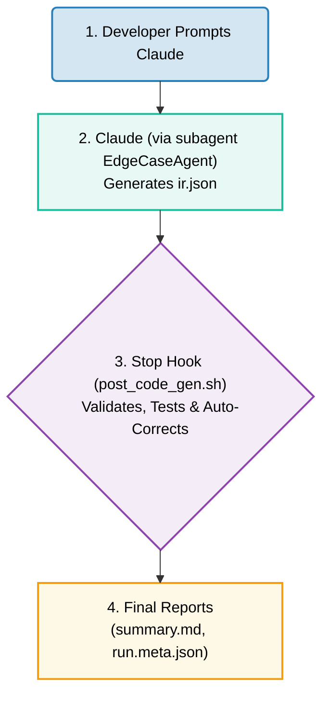

# Agent-Driven Edge Case Testing
A production-ready Claude Code pipeline for agent-driven test generation with bounded auto-correction and defense-in-depth validation. 

## Why use this workflow?
LLM-generated test specifications often fail in production because:
- Agent outputs don't match actual code behavior
- Unbounded correction loops mask real bugs  
- No traceability when tests fail
- Non-deterministic test generation

This pipeline provides a reusable pattern for agent-driven testing with safety guarantees.
## Prerequisites
To make the most of the agent-hook workflow in this repo, you'll need `Claude Code`, `Python`, and a working bash environment with `jq` installed. See [requirements.txt](requirements.txt) for pinned dependencies.

The code examples are written in Python and Bash, but the concepts remain the same across any programming language.
## Repository Table of Contents
### For Evaluators
* [Planning Document](./docs/planning.md): Includes scenario justification and planning approach
* [Optimizations & Future Work](./docs/main-guide.md#7-extending-the-pattern): Places where, given more time, improvements can be made to the submission
* [Submission Notes](./docs/submission-notes.md): Time-use breakdown and Claude transcript/conversation links
### Tool Use and Guides
* [Tool Details](./docs/main-guide.md): Main technical document with feature descriptions and conceptual information about agent-hook workflows
* [Implementation Deep-Dive](./docs/main-guide.md#4-implementation-deep-dive): Common issues and solutions
* [Best Practices & Common Pitfalls](./docs/main-guide.md#5-best-practices--common-pitfalls): Best practices and common pitfalls (and how to avoid them) when working with agent-hook workflows
## Key Features
**Highlights**: Multi-layer validation, bounded auto-correction, and automatic code testing
* **Custom agent** (EdgeCaseAgent) for structured test IR generation
* **3 validation layers** catching syntax, schema, and semantic errors  
* **Edge case tests** generated for the example `division.py` function
* **Max 1 auto-repair** attempt, then fail-fast classification
* **3 observability outputs**: pytest JSON, human summary, traceability manifest



## Quick Start
1. Clone the Repository:
```shell
git clone https://github.com/abean23/claude-code-agent-hooks
cd claude-code-agent-hooks
```

2. Set up the environment:
```shell
# Set up Python venv
python3 -m venv .venv
source .venv/bin/activate
pip install -r requirements.txt

# Ensure you have jq installed (system dependency, not Python)
jq --version

# If not installed:
# macOS: `brew install jq`
# WSL/Ubuntu/Debian: `sudo apt-get install -y jq`
```

3. Run the example:
```bash
#Generate edge case tests for the example division function
claude "$(cat examples/sample_prompt.txt)"
#Close out of Claude Code (ctrl-C), then open the human-readable test summary
cat outputs/reports/summary.md
# Expected output:
# Status: PASS
# Total: N tests | Passed: N ✓ | Failed: 0 ✗
# All tests passed - code meets IR specifications
```

## Why This Architecture?

**Bounded Auto-Correction Prevents Infinite Loops**  
One-time correction with `correction_attempted` flag ensures the system never masks real bugs with infinite IR rewrites

**Defense-in-Depth Validation**  
Three validation layers (syntax → schema → semantic) catch different error types with actionable messages in output logs

**Full Traceability**  
SHA256 checksums and git state tracking in `run.meta.json` enable reproducible debugging and traceability

**Deterministic by Design**  
Sorted test execution, pinned dependencies, and formatting using the `Black` library to eliminate non-deterministic noise

[See full technical rationale →](./docs/main-guide.md#3-architecture-patterns)

## Additional Resources
Some additional helpful links on Anthropic's Claude Code Agents and Hooks can be found here:
* [Get started with Claude Code hooks](https://docs.claude.com/en/docs/claude-code/hooks-guide)
* [Hooks reference](https://docs.claude.com/en/docs/claude-code/hooks)
* [Best practices for agentic coding](https://www.anthropic.com/engineering/claude-code-best-practices)
