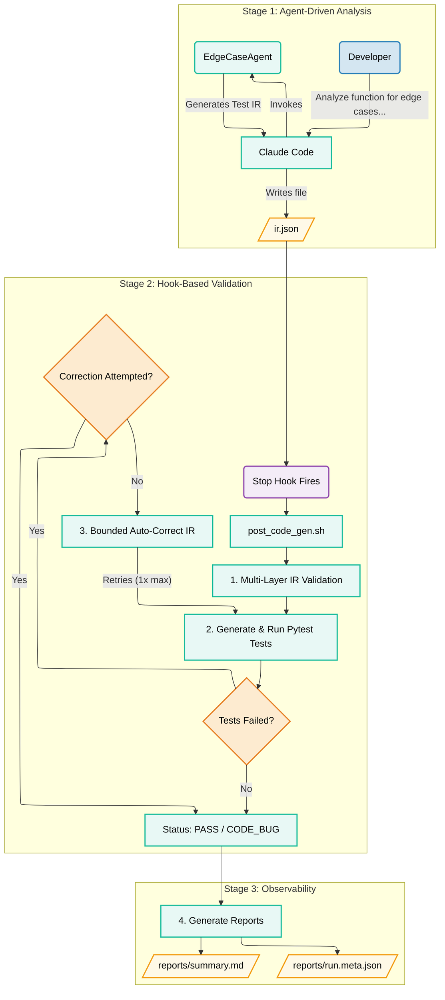

# Advanced Claude Code Agents & Hooks: Self-Correcting Validation Pipelines

## 1. Overview
LLMs are excellent at generating test ideas, but raw output is often incomplete, inconsistent, or malformed. This pipeline demonstrates a robust pattern for agent-driven test generation with hook-enforced validation, minimizing risk from non-deterministic agentic outputs.  

Use this pattern when:  
- You want to generate structured tests automatically from code or natural language.  
- You need safety and traceability beyond raw LLM output.  
- You want bounded auto-correction that fixes IR mismatches without masking real bugs.  

This guide covers the full architecture: agents, hooks, validation layers, correction logic, and observability.

---

## 2. Core Concepts

### 2.1 Agent-Hook Architecture
Agents may drift or produce prose; hooks act as the guardrail that ensures reliable downstream execution.

- **Agents** handle reasoning (edge case discovery, structured IR generation).
- **Hooks** guarantee enforcement (validation, test execution, reporting).  
- **Contract**: JSON IR is the interface between agent and hook.  

### 2.2 The Intermediate Representation (IR)
LLMs are great at reasoning about edge cases but not always reliable at writing runnable code directly. By having the model output JSON IR instead of raw Python or natural language, we ensure its output is constrained, checkable, and validatable. The subagent `EdgeCaseAgent` in this pipeline outputs IR JSON back to the main Claude Code orchestration layer for writing to a file.

#### Example IR Schema:
```json
{
  "target": "division:divide",             // function under test
  "cases": [
    {
      "id": "divide_nan_by_number",       // unique identifier
      "call": { "args": ["NaN", 1.0] },   // how the function is invoked
      "expectation": {                    // what should happen
        "predicate": { "name": "math.isnan" }  // special semantic check
      }
    }
  ]
}

```
#### Schema Field-by-Field:
| **Field**               | **Type**         | **Example**                            | **Description**                                                                |
| ----------------------- | ---------------- | -------------------------------------- | ------------------------------------------------------------------------------ |
| `target`                | string           | `"division:divide"`                    | Fully qualified function reference (`module:function`) under test.             |
| `cases`                 | array of objects | *(see below)*                          | List of test cases describing inputs and expected outputs.                     |
| `id`                    | string           | `"divide_by_zero"`                     | Unique identifier for the test case. Useful for sorting, logging, and reports. |
| `call.args`             | array            | `[1.0, 0.0]`                           | Positional arguments to pass into the function.                                |
| `call.kwargs`           | object (dict)    | `{"precision": 5}`                     | Optional keyword arguments for the function call.                              |
| `expectation.raises`    | object           | `{ "types": ["ZeroDivisionError"] }`   | Function should raise one of the listed exceptions.                            |
| `expectation.equals`    | object           | `{ "value": 5.0, "tolerance": 1e-10 }` | Function should return this value (with optional tolerance for floats).        |
| `expectation.predicate` | object           | `{ "name": "math.isnan" }`             | Function output should satisfy a predicate (e.g., `math.isnan`, `math.isinf`). |


### 2.3 Defense-in-Depth Validation
The structure of the output IR allows us to verify and validate our test cases in a few main ways:
#### 1) **Syntax**: catches malformed JSON, auto-fixes
This is accomplished by the Python script [IRProcessor.py](../pipeline/IRProcessor.py) in two steps:
1. *IRValidator* step: `json.loads(...)` the cleaned text and raises a ValidationError with actionable context if parsing fails
2. *IRSyntaxFixer* step: cleans known non-JSON tokens (e.g., `float('nan')` → `"NaN"`, `float('inf')` → `"Infinity"`)

Excerpt from IRProcessor:
```python
# From IRProcessor.py:70-75
def fix_python_float_expressions(content: str) -> tuple[str, bool]:
    """LLMs often output Python code instead of JSON strings"""
    content = re.sub(r"float\(['\"]nan['\"]\)", '"NaN"', content)
    content = re.sub(r"float\(['\"]inf['\"]\)", '"Infinity"', content)
    content = re.sub(r"float\(['\"]-inf['\"]\)", '"-Infinity"', content)
    return content, content != original
```
This handles the common case where agents output float('nan') (Python) instead of "NaN" (JSON string). The regex replacement makes the IR parseable while preserving semantics.

[See full implementation ->](../pipeline/IRProcessor.py#L70-L75)

#### 2) **Schema**: ensures required fields, correct types, approved predicates
* Verifies required top-level fields exist: target (string), cases (array).
* Validates each case’s shape: id (string), call.args (list), optional call.kwargs (object).
* Enforces expectation type: exactly one of raises / equals / predicate.
* Guards allowed predicate names (e.g., math.isnan, math.isinf, math.isfinite) and types within equals (value + optional tolerance).

Excerpt from IRProcessor.py:
```python
# From IRProcessor.py:195-220
def _validate_case(self, func: callable, case: Dict[str, Any]) -> Dict[str, Any]:
    args = self._process_args(call.get("args", []))
    kwargs = self._process_args(call.get("kwargs", {}))
    
    try:
        actual = func(*args, **kwargs)
        valid, reason = self._check_expectation(actual, expectation)
        
        return {
            "case_id": case_id,
            "valid": valid,
            "actual": actual,
            "expected": expectation,
            "reason": reason
        }
    except Exception as e:
        # Check if exception was expected
        if "raises" in expectation:
            expected_types = expectation["raises"]["types"]
            if type(e).__name__ in expected_types:
                return {"case_id": case_id, "valid": True}
```
This is the core of semantic validation-- it executes the actual function with test inputs and compares behavior against expectations. The `_process_args` call converts IR special values (`"NaN"` -> `float('nan')`) before execution. If the function raises an exception, the validator checks whether that exception was expected or represents a mismatch. This approach catches expectation errors that schema validation would miss - for example, an IR claiming `divide(1, 0)` returns `5.0` when it actually raises `ZeroDivisionError`.
 
[See full implementation ->](../pipeline/IRProcessor.py#L195-L220)

#### 3) **Semantics**: runs the target function with IR arguments and compares results

* Resolves the target function (module:function) and imports the module (your CLI target_module can override the module portion if needed)
* Converts special IR values before calling (`"NaN"` → `float('nan')`, `"Infinity"` → `math.inf`)
* Executes the real function with each case’s args/kwargs
* Compares actual behavior to the case’s expectation
* Collects mismatches in [hook_log.txt](../outputs/hook_log.txt). If there are any, performs one bounded auto-correction pass to update expectations to what the code actually does


### 2.4 Bounded Auto-Correction
Excerpt from IRProcessor.py:
```python
# From IRProcessor.py:310-330
def correct(self, ir_path: Path, target_module: str, output_path: Optional[Path] = None):
    mismatches = self.validator.validate(ir_path, target_module)
    
    if not mismatches:
        return {"corrected": 0, "total": 0}
    
    # Update each failing case's expectation
    for mismatch in mismatches:
        case_id = mismatch["case_id"]
        for case in ir_data["cases"]:
            if case["id"] == case_id:
                case["expectation"] = self._create_expectation(mismatch["actual"])
                corrections += 1
                break
```
The correction loop validates the IR, identifies mismatches between expected and actual behavior, then updates each failing case's expectation to match reality. Critically, this happens exactly once. The method is called by the hook only when `correction_attempted=false`, preventing infinite correction loops. The return value provides transparency: it reports how many cases were corrected and why, making it clear whether failures indicate IR issues or genuine code bugs.
[See full implementation ->](../pipeline/IRProcessor.py#L310-L330)

## 3. Architecture Patterns

### Pattern 1: Agent-Driven Analysis
Agent-driven generation is best used when deterministic code is not capable of parsing input data and returning the desired outputs, usually due to inconsistency in the input formats. In this pipeline, generating edge cases is an optimal use of a subagent like `EdgeCaseAgent`.

**Key decisions for this pipeline**:  
- Prompt design must enforce JSON-only output
- Scope context tightly to the function under test
- Disallow prose or Markdown formatting

---

### Pattern 2: Hook-Based Validation
The common theme in this repo is that while subagents are incredibly powerful, their non-deterministic nature can make the use of their outputs in deterministic code very difficult. Hooks, in this case a `Stop` hook alongside the command `post_code_gen.sh`, mitigate those difficulties to ensure safer subagent integration.

**Key decisions for this pipeline**:  
- Use Stop hook to run full validation + test orchestration 
- Persist artifacts under `outputs/` for reproducibility and visibility

---

### Pattern 3: Bounded Correction with Failure Classification
Even with schema validation in place, there are times when the Intermediate Representation (IR) may not perfectly align with actual code behavior. Instead of letting these mismatches cascade into further failures, this pipeline introduces a bounded correction loop: the IR is given one opportunity to be auto-corrected, after which the system classifies the failure to ensure clarity and safety.

**Key decisions for this pipeline**:
* Enforce a single correction attempt to balance resilience with safety.
* Clearly classify failure types to distinguish IR issues from real code bugs.
* Preserve all artifacts (raw IR, corrected IR, reports) to maintain full traceability.

---

## 4. Implementation Deep-Dive

### 4.1 EdgeCaseAgent Design
EdgeCaseAgent is the subagent in this pipeline, and analyzes code for potential edge cases, generating IR JSON for later use in the workflow.

We need to constrain the agent in a few ways with the prompt we give it:
- Outputs raw JSON only, no Markdown/tool calls
- Ensure JSON structure aligns with the expected IR schema

Here is an export of how this agent is constrained:
```markdown
CRITICAL INSTRUCTIONS:
- Your response must contain ONLY raw JSON text
- No markdown code blocks, no explanations, no tool invocations

Required JSON structure:
{
  "target": "module:function",
  "cases": [
    {
      "id": "case_id",
      "call": {"args": [value1, value2]},
      "expectation": {"raises": {"types": ["ErrorType"]}}
    }
  ]
}

Expectation formats:
- Exception: {"raises": {"types": ["ValueError", "TypeError"]}}
- Numeric: {"equals": {"value": 5.0, "tolerance": 1e-10}}
- Predicate: {"predicate": {"name": "math.isinf"}} or {"predicate": {"name": "math.isnan"}}

CRITICAL: Special float values in args MUST use JSON-compatible strings:
- Use "NaN" NOT float('nan')
- Use "Infinity" NOT float('inf')
- Use "-Infinity" NOT float('-inf')
Example: {"args": ["Infinity", 2]} CORRECT
Example: {"args": [float('inf'), 2]} WRONG (invalid JSON)
```
Note that even though we make every effort to constrain the agent in the agent prompt, it is by nature non-deterministic and can output data with variance even when controlling for things like temperature and top_p-- this is the crux of our entire workflow, and why we use hooks to verify, validate, and repair our agent output.
> Note to reviewers: given more time, it could be prudent to develop a tool specifically for this agent to use that would ensure closer alignment to IR schema requirements

### 4.2 Validation Pipeline
- **IRSyntaxFixer** -> auto-fix common errors.  
- **IRValidator** -> runs syntax, schema, semantic checks.  
- **IRCorrector** -> updates expectations to match actual results (once).  

Excerpt from IRProcessor.py:
```python
# From IRProcessor.py:348-365
def _create_expectation(self, actual: Any) -> Dict[str, Any]:
    """Only generates expectations using approved predicates"""
    if isinstance(actual, dict) and "exception" in actual:
        return {"raises": {"types": [actual["exception"]]}}
    
    if isinstance(actual, float):
        if math.isnan(actual):
            return {"predicate": {"name": "math.isnan"}}
        if math.isinf(actual):
            return {"predicate": {"name": "math.isinf"}}
        return {"equals": {"value": actual, "tolerance": 1e-10}}
    
    return {"equals": {"value": actual, "tolerance": 1e-10}}
```
When correcting IR, this method generates new expectations based on actual function behavior, but only using approved predicates (`math.isnan`, `math.isinf`, `math.isfinite`). This constraint prevents the corrector from generating arbitrary or unsafe expectations. For example, if a function returns `NaN`, the corrector creates `{"predicate": {"name": "math.isnan"}}` rather than trying to express "not a number" in some other way. Complex numbers trigger an error requiring manual review, ensuring edge cases don't silently generate invalid IR.
[See full implementation ->](../pipeline/IRProcessor.py#L348-L365)

### 4.3 Hook Orchestration
The Stop hook in `.claude/hooks/post_code_gen.sh` orchestrates the entire validation-correction-reporting pipeline.

The Hook starts by detecting IR file, and exits gracefully if absent:
```bash
# Step 1: IR Detection & Setup
ir_file="$CLAUDE_PROJECT_DIR/outputs/ir.json"
if [ ! -s "$ir_file" ]; then
  log "No IR—skipping"
  exit 0
fi
log "IR found: $ir_file"

export PYTHONPATH="$CLAUDE_PROJECT_DIR:$PYTHONPATH"
```
Next, the hook pre-validates to catch syntax errors before attempting test generation:
```bash
# Step 2: Pre-validation of IR JSON syntax
log "Pre-validating IR JSON syntax"
target=$(jq -r '.target' "$ir_file" 2>/dev/null | cut -d':' -f1)

if python3 "$CLAUDE_PROJECT_DIR/pipeline/IRProcessor.py" "$ir_file" "$target" >> "$LOG_FILE" 2>&1; then
  log "IR JSON syntax validated successfully"
else
  log "IR JSON syntax validation/correction failed"
  exit 1
fi
```
The orchestrator script then generates and runs tests:
```bash
# Step 3: Test generation and orchestration
correction_attempted=false
max_correction_attempts=1

python3 "$orch_path" --in "$ir_file" --out "$out_file" --report "$report_file" --run --format 2>> "$LOG_FILE" || {
  log "Orchestrator failed"
  exit 1
}
```
Finally, we incorporate the bounded correction loop and classify the outcome:
```bash
# Step 4: Bounded correction and outcome classification
if [ -f "$report_file" ]; then
  failed=$(jq -r '.counts.failed // 0' "$report_file")

  if [ "$failed" -gt 0 ] && [ "$correction_attempted" = false ]; then
    log "Tests failed: $failed cases"
    log "Attempting IR correction (attempt 1/$max_correction_attempts)"

    target=$(jq -r '.target' "$ir_file" | cut -d':' -f1)

    if python3 "$CLAUDE_PROJECT_DIR/pipeline/IRProcessor.py" "$ir_file" "$target" >> "$LOG_FILE" 2>&1; then
      log "IR corrected successfully"
      correction_attempted=true

      # Re-run tests with corrected IR
      python3 "$orch_path" --in "$ir_file" --out "$out_file" --report "$report_file" --run 2>> "$LOG_FILE"

      # Check if correction fixed the issues
      failed_after=$(jq -r '.counts.failed // 0' "$report_file")
      if [ "$failed_after" -eq 0 ]; then
        log "IR correction successful - all tests passing"
      else
        log "Tests still failing after correction - likely a real bug in the code"
      fi
    fi
  elif [ "$failed" -gt 0 ]; then
    log "Tests failing but correction already attempted - likely real bugs in code"
  fi
fi
```

[See full implementation ->](../scripts/post_code_gen.sh#L63)<br/>

* Reports are written to (`pytest.json`, `summary.md`, `run.meta.json`)

### 4.4 Observability System
- **run.meta.json**: this is where the traceability features of the pipeline are found. Includes Git hashes, version information, and a summary of the prompt used for the given Hook event. Excerpt:
```json
  "timestamp": "2025-10-02T03:21:24.143948Z",
  "git": {
    "commit": "e3cf9151ae209d304a02baec2fab364629ff7c7c",
    "branch": "main",
    "dirty": true
  },
  "versions": {
    "python": "Python 3.12.3",
    "pytest": "7.4.4",
    "jsonschema": "4.10.3",
    "black": null
  },
  "traceability": {
    "agent_used": "EdgeCaseAgent",
    "agent_config": "/home/austin/claude-code-agent-hooks/.claude/agents/edge_case_agent.md",
    "prompt_summary": "Analyze code for edge cases and generate structured IR",
    "note": "Full agent prompt available in agent_config file"
  }
```
- **summary.md**: Human-readable summary of the testing results.
```markdown
# Test Summary Report

**Generated**: 2025-10-02 03:21:24 UTC
**Status**: PASS

## Results
- **Total**: 18 tests
- **Passed**: 18 ✓
- **Failed**: 0 ✗
- **Pass Rate**: 100.0%

## Diagnosis
✓ All tests passed - code meets IR specifications

---
*Full details in pytest.json*

```

- **pytest.json**: Machine-readable summary of the testing results in JSON. Contains test id and pass status for each test run.


## 5. Best Practices & Common Pitfalls

- **Unbounded Correction Loops** <br /> 
Allowing your code to automatically correct malformed IR JSON is effective, but occasionally this can introduce additional bugs or infinite loops if not bounded properly. In this repo, it is fixed by incorporating the `correction_attempted` guard, simply flipping the flag from `false` to `true` after a correction attempt:
```bash
correction_attempted=false  # Initialize at hook start

if [ "$failed" -gt 0 ] && [ "$correction_attempted" = false ]; then
  # Only enters this block once
  correction_attempted=true
  # ... correction logic
elif [ "$failed" -gt 0 ]; then
  # Second failure path - no more attempts
  log "Tests failing but correction already attempted - likely real bugs in code"
fi
```
- **Masking Real Bugs**: <br />
Semantic validation prevents the IR from “papering over” problems in the underlying code. Even if the IR claims a function should return a certain value, the pipeline always executes the real function and compares results, ensuring that defects in the implementation are surfaced as CODE_BUG rather than hidden by faulty expectations.
- **PostToolUse Unreliability**: <br />
In Claude Code's current iteration (`2.0.2` at the time of writing), `PostToolUse` hooks can fire intermittently. This was solved in this repo by using a Stop hook instead.  
- **Agent Context Overload**:<br />
Improperly scoped agent prompts can lead to dilution of Claude Code's context. In `EdgeCaseAgent`'s case, asking it to generate edge cases without specifying a file can lead to unexpected results. It's imperative to tightly scope agents when asking them to run tasks: 
```
Analyze the Python function divide() in division.py using the EdgeCaseAgent.
From the EdgeCaseAgent, extract the JSON from the response, and write it to outputs/ir.json.
```
- **Claude Code not writing IR to file**: <br />This usually happens in longer conversations with Claude. Simply prompt Claude to write the IR output from EdgeCaseAgent to your ir file again `"Write the IR output from EdgeCaseAgent is located in ir.json. Read the file after to verify the write was successful."`  

## 6. Measuring Success

**Outcomes:**<br />
Four outcomes are possible at the end of the workflow, diagnosed in [summary_generator.py](../pipeline/summary_generator.py):
```python
if failed == 0: # No failed tests
        diagnosis = "✓ All tests passed - code meets IR specifications"
        status = "PASS"
    else:
      # ... additional logic
        # Using simple heuristic; if all tests fail, likely IR issue
        if failed == total: # All tests failed
            diagnosis = "⚠ All tests failed - likely IR specification issue"
            status = "IR_INVALID"
        elif failed > total * 0.7: # >70% of tests failed
            diagnosis = "⚠ Most tests failed - likely IR specification issue"
            status = "IR_MISMATCH"
        else: # <70% of tests failed
            diagnosis = "✗ Some tests failed - code under test may have bugs"
            status = "CODE_BUG"
```

**Metrics:**
This pipeline has a human-readable summary file that displays metrics at [summary.md](../outputs/reports/summary.md).
```md

# Test Summary Report

**Generated**: 2025-10-01 20:16:01 UTC
**Status**: PASS

## Results
- **Total**: 20 tests
- **Passed**: 20 ✓
- **Failed**: 0 ✗
- **Pass Rate**: 100.0%

## Diagnosis
✓ All tests passed - code meets IR specifications
---
*Full details in pytest.json*

```

**Benchmarks**:
* Basic coverage: 8-12 cases (zero, NaN, infinity, basic types)
* Good coverage: 15-20 cases (adds boundary values, overflow/underflow)
* Comprehensive coverage: 25+ cases (includes combined conditions, edge interactions)


## 7. Extending the Pattern

- **Other Languages** -> swap pytest for Jest/JUnit, keep IR schema identical
- **Other Test Types** -> extend schema for integration/performance tests
- **CI/CD Integration** -> block merges on `CODE_BUG`, publish reports as artifacts
- **Future Optimizations**: IR canonicalization, property-based testing, mutation demo toggle, CI gates 
